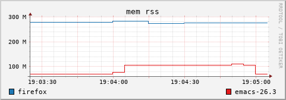

Oprs
====

Oprs is a process monitor for Linux. The name is an abbreviation for Observe Process ReSources.

It's based on [procfs](https://crates.io/crates/procfs).

Features
--------

* Monitor memory, execution time, input/output, page fault, file descriptors, mapped memory regions.
* Optional minimum and maximum.
* Select processes by PID, PID file or name.
* Display in plain text or a terminal UI.
* Export in CSV or RRDtool format.

In a terminal, if no process is specified on the command line, all the visible processes are displayed
in a tree.

Example
-------

To get the memory size, elapsed time and page fault of a process by PID (firefox), a process by pid
file (pulseaudio) and a process by name (bash), run:

    oprs -F human -p 29220 -f pulseaudio.pid -n zellij mem:vm mem:rss+max time:elapsed fault:major

Metrics
-------

Use option `--list` to print the list of available metrics.

Limited patterns are allowed for metrics: by prefix mem:*, suffix *:call, both io:*:count.

A metric may be followed by a unit. For example: mem:vm/gi. It's usually easier to use
`--format human`.

Available units:
- ki  kibi
- mi  mebi
- gi  gibi
- ti  tebi
- k   kilo
- m   mega
- g   giga
- t   tera
- sz  the best unit in k, m, g or t.
- du  format duration as hour, minutes, seconds.

Metrics can be also aggregated using +min and/or +max. For example mem:vm+max/gi prints the virtual
memory size and the peak size. To get only the max, use: mem:vm-raw+max. To get all: mem:vm+min+max.

For some metrics, min or max is meaningless.

By default, the raw figure is printed unless -raw is added: mem:rss-raw+min+max. 

For CPU and the system and user time of a process, there is also the aggregated ratio over the
entire system. Typically, time:cpu-raw+ratio prints the CPU usage.

The default metrics are the CPU usage, the VM size and the elapsed time.

### Data type

Metrics are either:
- Counters: values that always increase like the number of read call or the CPU time.
- Gauges: positive values that may decrease such as the memory comsumptions.

### CPU usage

Unlike other tools, the CPU usage of a process displayed by time:cpu+ratio is the percentage of the
total CPU time. A process using all cores of a 4-cores system would be at 100%, not 400%.

The CPU usage is (stime + utime) / ((user - guest) + (nice - guest_nice) + system + idle + iowait + irq + softirq)
where stime and utime comes from /proc/PID/stat and user, … from /proc/stat.

Processes
---------

Processes are selected using one of the four following options:

- Option --pid: the pid of the process.

- Option --pid-file: file containing the pid of the process. It doesn't have to exists when the command starts.

- Option --name: monitor all processes with the given name.

Options can be specified more than once.

Export
------

### CSV

In CSV export, the first column is the number of seconds since the [Unix Epoch](https://en.wikipedia.org/wiki/Unix_time).

The size of exported data can be limited with `--export-size` to set the maximum size of a CSV file and `--export-count`
to set the maximum number of files.

### Round Robin Database (RRD)

Creates one RRD database for each process by spawning a [RRDtool](https://oss.oetiker.ch/rrdtool/) process. Only raw values
are written in the database.

The number of rows is set with option --export-count.

Option `--graph` creates one png file per metric in the export directory.

Configuration
-------------

Configuration file name is `settings.ini`. It's located according to
the [XDG Base Directory Specification](https://specifications.freedesktop.org/basedir-spec/latest/).

Example `~/.config/oprs/settings.ini`:

    [display]
    mode = term
    every = 10
    format = human
    theme = light
    border = yes

    [export]
    kind = csv
    dir = /tmp
    size = 10m
    count = 5

    [logging]
    file = /var/log/oprs.log
    level = info

    [targets]
    system = yes
    myself = yes

License
-------

Copyright (c) 2020-2025 Laurent Pelecq

`oprs` is distributed under the terms of the GNU General Public License version 3.

See the [LICENSE GPL3](LICENSE) for details.
