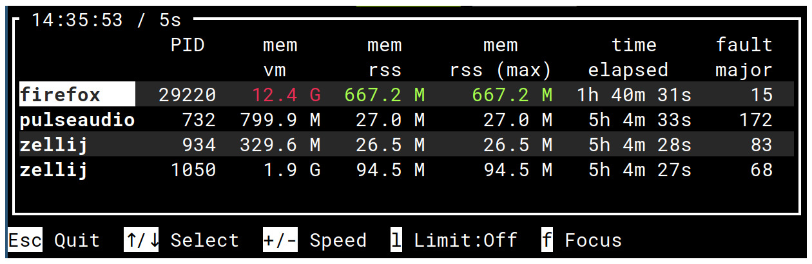

Oprs
====

Oprs is a process monitor for Linux. The name is an abbreviation for Observe Process ReSources.

It's based on [procfs](https://crates.io/crates/procfs).

Features
--------

* Monitor memory, execution time, input/output, page fault.
* Optional minimum and maximum.
* Select processes by PID, PID file or name.
* Display in plain text or a terminal UI.

Basic usage
-----------

To get the memory size, elapsed time and page fault of a process by PID (firefox), a process by pid
file (lvmetad) and a process by name (bash), run:

    oprs --human -p 786 -f pulseaudio.pid -n dhclient -m mem:vm mem:rss+max time:elapsed fault:major

Without argument, the command prints the available metrics.

By default, the raw figure is printed unless -raw is added: mem:rss-raw+min+max. 

CPU usage
---------

Unlike other tools, the CPU usage of a process displayed by time:cpu+ratio is the percentage of the
total CPU time. A process using all cores of a 4-cores system would be at 100%, not 400%.

The CPU usage is (stime + utime) / ((user - guest) + (nice - guest_nice) + system + idle + iowait + irq + softirq)
where stime and utime comes from /proc/PID/stat and user, … from /proc/stat.

Export
------

In CSV export, the first column is the number of seconds since the [Unix Epoch](https://en.wikipedia.org/wiki/Unix_time).

License
-------

Copyright (c) 2020 Laurent Pelecq

`oprs` is distributed under the terms of the GNU General Public License version 3.

See the [LICENSE GPL3](LICENSE) for details.
